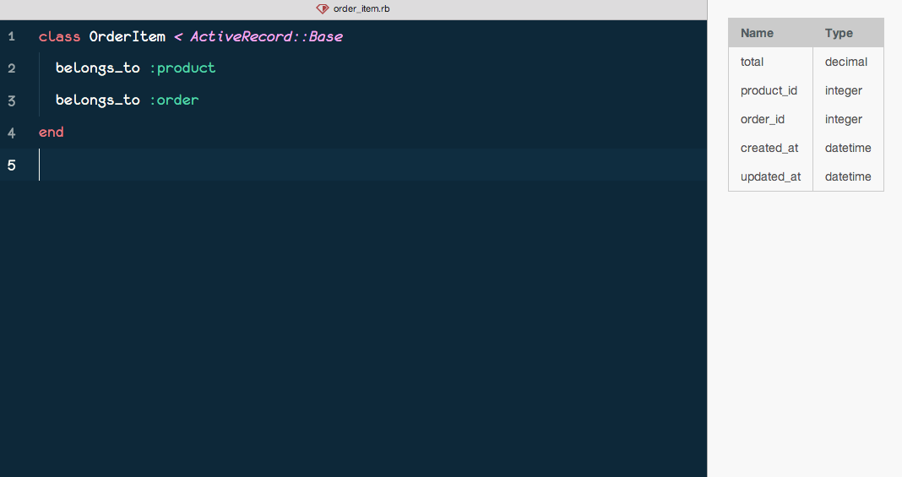

# Rails Model Schema

A Atom package to show the schema of your [Rails](https://github.com/rails/rails) models when you open a file. It looks like this: (gif screencasts are coming)



## Usage

It's automatic when you open a ruby file with a class declaration. If you want to toggle the sidebar for some reason, you have to use next keyboard shortcut:

```
⌃ + ⇧ + ⌘ + M
```

## Current Drawbacks
- For now, it only displays the each attributes's name and type.
- It doesn't watch the `schema.rb` file changes so you have to toggle the sidebar after a migration.
- It works by reading the class name of a ruby file, so if the model doesn't have the name of the table (for example, when using simple model inheritance or setting the table name with `self.table_name=`), it won't work.
